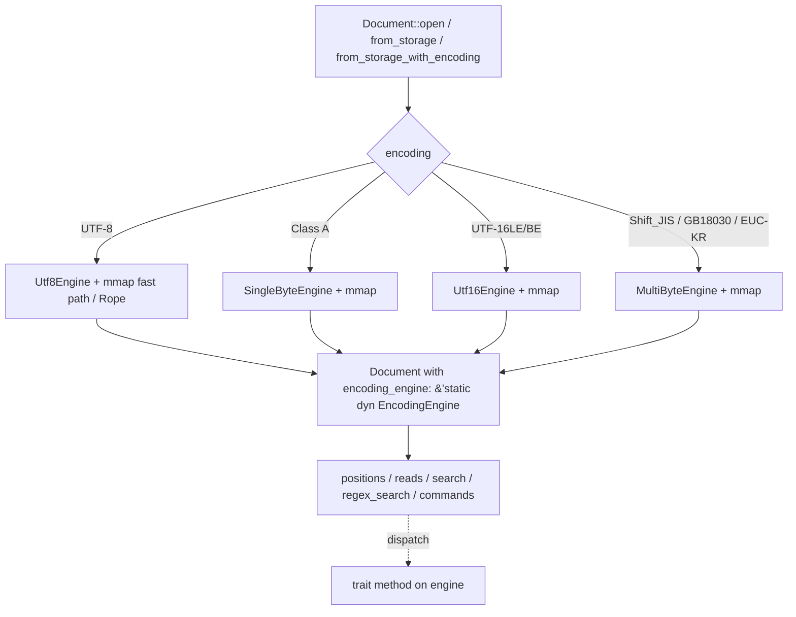
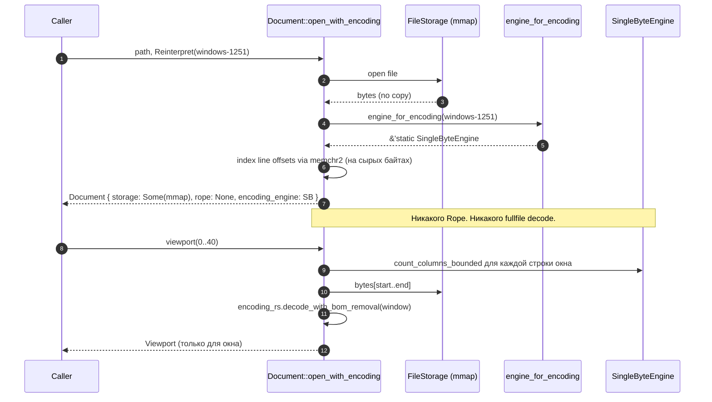
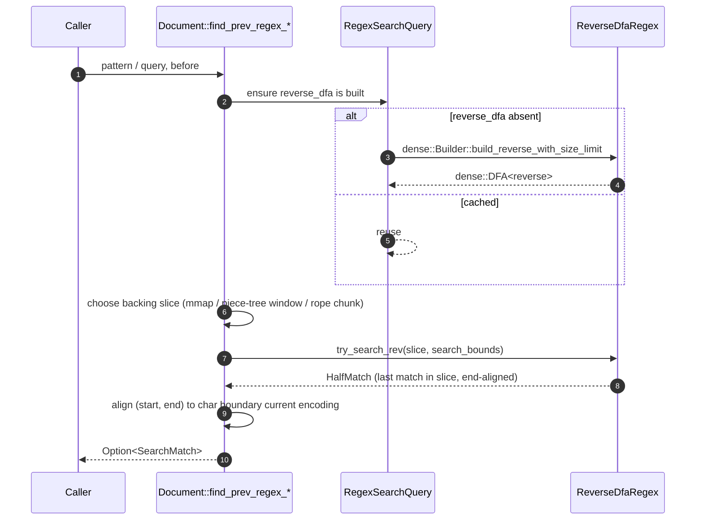

# Design Document

## Overview

`encoding-aware-engine` превращает encoding-слой Qem из «один UTF-8 rope с
fallback-транскодом» в набор нативных по-байтовых движков. Каждая
поддерживаемая кодировка обслуживается одной реализацией трейта
`EncodingEngine`, к которой документ обращается через сохранённую в нём
ссылку. Цель релиза `0.8.0` — закрыть требования R1–R17 без введения
полно-фального rope для не-UTF-8 файлов и без своего regex-движка.

Дизайн сознательно консервативен:

- **Минимальные изменения существующего**: `Utf8Engine` уже корректен,
  его API только расширяется методом `step_backward`. Все остальные
  методы остаются байтово-идентичными `0.7.1`.
- **Один трейт, четыре реализации**: `Utf8Engine`, `SingleByteEngine`,
  `Utf16Engine<E: Endian>`, `MultiByteEngine`.
- **Никакого транскода** не-UTF-8 содержимого в UTF-8 как стратегии
  поддержки кодировки (R16.1). UTF-8-rope сохраняется только для тех
  документов, чей контракт уже UTF-8.
- **Никакого своего regex-движка**: используем `regex 1.12` и
  добавляем `regex_automata 0.4` для reverse-DFA пути.
- **Ropey остаётся в `0.8`** для UTF-8 редактирования и удаляется в
  `0.9.0` (R16.2).

Релиз разбит на инкрементальные фазы 2 → 11. Каждая фаза проходит
build gate (`cargo fmt --all --check`,
`cargo clippy --all-targets --all-features --workspace -- -D warnings`,
`cargo test --all-features --workspace`) до признания завершённой
(R16.4). Ни одна фаза не публикуется в crates.io и не пушится в GitHub
без явного подтверждения пользователя (R16.5).

### Связь с requirements.md

| Группа требований | Что закрывает дизайн                                             |
| ----------------- | ---------------------------------------------------------------- |
| R1, R2            | Поле `Document::encoding_engine`, миграция callsites             |
| R3, R4, R5, R6    | Конкретные реализации `EncodingEngine` и open-dispatch           |
| R7, R13           | Edit-buffer не-UTF-8 через piece-tree + round-trip insert        |
| R8                | Reverse-DFA regex                                                |
| R9, R12, R11, R10 | Корректностные свойства: round-trip, alignment, симметрия шагов  |
| R14               | `PerEncodingTestSuite` с tmpdir на `D:\qem_test_tmp`             |
| R15               | Матрица кодировок в README и rustdoc                             |
| R16, R17          | Запреты, build gate, политика семвера                            |

## Architecture

### Высокоуровневая диспетчеризация



`engine_for_encoding(encoding)` — единственный публичный (внутри крейта)
factory. Он строит и кэширует все четыре типа реализаций через
`OnceLock` так, что каждый `Document` за свой жизненный цикл получает
один и тот же `&'static dyn EncodingEngine` и не платит за
диспетчеризацию ничего, кроме одного indirect call на hot path.

### Открытие документа Class A (R4)



### Вставка в документ Class A / Class B (R7)

```mermaid
sequenceDiagram
    autonumber
    participant App as Caller
    participant Doc as Document::try_insert
    participant Enc as encoding_rs::Encoding::encode
    participant PT as PieceTree
    App->>Doc: position, &str
    Doc->>Doc: clamp position to char boundary (Class A=1, UTF-16=2, Class B=по детектору)
    Doc->>Enc: encode(text, target_encoding)
    Enc-->>Doc: bytes, output_encoding, had_unmappable
    alt had_unmappable
        Doc-->>App: Err(DocumentEncodingErrorKind::UnrepresentableText)
    else ok
        Doc->>PT: append to add_buffer; insert Piece(Add, byte_offset, byte_len)
        PT-->>Doc: ok
        Doc-->>App: TextPosition (после правки)
    end
```

### Reverse-DFA regex (R8)



## Components and Interfaces

### EncodingEngine — финальный API (R10)

`src/document/encoding_engine.rs`. Полная сигнатура трейта (все методы
с pre/post). По сравнению с фазой 1 добавлен один метод
`step_backward`; остальные unchanged.

```rust
/// Byte-level операции, которых документ-слою требует от кодировки.
///
/// Все смещения — байтовые в пределах сырых хранимых байтов
/// (mmap или piece-tree buffer). Реализации обязаны быть дешёвыми и
/// безаллокационными для горячих методов (`step`, `step_backward`,
/// `next_line_start`, `count_columns_*`).
pub(crate) trait EncodingEngine: Send + Sync + std::fmt::Debug {
    /// Возвращает кодировку, для которой собран этот движок.
    fn encoding(&self) -> DocumentEncoding;

    /// Длина (в байтах) одного символа, начинающегося в `offset`,
    /// в пределах `bytes[..end]`.
    ///
    /// Pre:  `offset <= end <= bytes.len()`.
    /// Post: возвращаемое `n` либо `0` (когда `offset >= end`), либо
    ///       `1 <= n <= 4`, и `offset + n <= end`. На `offset == end`
    ///       результат `0`. Iteration `offset += step(...)` должна
    ///       терминироваться (R3.3, R5.2/3).
    fn step(&self, bytes: &[u8], offset: usize, end: usize) -> usize;

    /// Длина (в байтах) символа, заканчивающегося в `offset`,
    /// в пределах `bytes[start..offset]`.
    ///
    /// Pre:  `start <= offset <= bytes.len()`.
    /// Post: либо `0` (когда `offset == start`), либо `1..=4`, и
    ///       `offset - n >= start`. Симметрия `step_forward`/`step_backward`
    ///       (R10): для всех допустимых `p`,
    ///       `step_forward(step_backward(p)) == p` и (если
    ///       `step_forward(p) > 0`) `step_backward(step_forward(p)) == p`.
    fn step_backward(&self, bytes: &[u8], offset: usize, start: usize) -> usize;

    /// Смещение начала следующей строки за `line_start`, в пределах
    /// `bytes[..file_len]`. Если перевода строки нет — `file_len`.
    ///
    /// Pre:  `line_start <= file_len <= bytes.len()`.
    /// Post: результат `s` удовлетворяет `line_start <= s <= file_len` и
    ///       `s` — на границе символа кодировки (R11.1). CRLF
    ///       схлопывается в одну границу.
    fn next_line_start(&self, bytes: &[u8], file_len: usize, line_start: usize) -> usize;

    /// Точное число text-units (столбцов) в `bytes`, до первой
    /// последовательности перевода строки.
    fn count_columns_exact(&self, bytes: &[u8]) -> usize;

    /// То же, ограниченное `max_cols`.
    fn count_columns_bounded(&self, bytes: &[u8], max_cols: usize) -> usize;

    /// Сдвиг `start` на `text_units` символов вперёд в `bytes[..file_len]`.
    ///
    /// Pre:  `start <= file_len <= bytes.len()`.
    /// Post: возвращаемое `o` удовлетворяет `start <= o <= file_len` и
    ///       `o` — на границе символа. CRLF — один text unit.
    fn advance_offset_by_text_units(
        &self,
        bytes: &[u8],
        file_len: usize,
        start: usize,
        text_units: usize,
    ) -> usize;
}
```

#### Замечания по `step_backward`

- В `Utf8Engine` реализуется через `is_utf8_continuation`: ходим назад,
  пока байт `0xxxxxxx` или leading-байт; CRLF трактуется как один
  text-unit и шагается на 2 байта.
- В `SingleByteEngine` — всегда `1` (или `0` на `start`), плюс
  CRLF-схлопывание на `\n` с предшествующим `\r`.
- В `Utf16Engine<E>` — `2` для BMP-юнита, `4` если предыдущий код-юнит —
  low surrogate.
- В `MultiByteEngine` — линейное «scan-from-anchor» от ближайшей
  известной границы (см. R10/R11/section ниже про edit-time alignment).

#### Минимальные изменения `Utf8Engine`

Текущий `Utf8Engine` (фаза 1) меняется минимально:

- Добавляется реализация `step_backward` через
  `align_utf8_boundary_backward` + проверка CRLF.
- Все остальные методы делегируют существующим free-функциям без
  изменений (R1.6 — 339 тестов остаются зелёными).

```rust
impl EncodingEngine for Utf8Engine {
    // ... existing methods unchanged ...

    fn step_backward(&self, bytes: &[u8], offset: usize, start: usize) -> usize {
        let offset = offset.min(bytes.len());
        if offset <= start { return 0; }
        // CRLF as one unit
        if offset >= 2 && bytes[offset - 1] == b'\n' && bytes[offset - 2] == b'\r'
            && offset - 2 >= start
        {
            return 2;
        }
        let aligned = super::align_utf8_boundary_backward(bytes, offset - 1);
        offset - aligned.max(start)
    }
}
```

### Document — поле `encoding_engine`

`src/document.rs` (struct `Document`). Добавляется поле:

```rust
pub struct Document {
    // ... existing fields ...
    /// Sticky reference на encoding-aware движок текущей кодировки.
    /// Обновляется только в одной транзакции с `encoding` (R1.4).
    encoding_engine: &'static dyn encoding_engine::EncodingEngine,
}
```

#### Инициализация в конструкторах

Поле заполняется через `engine_for_encoding(self.encoding)` во всех
конструкторах:

| Конструктор                                  | Файл                              | Что подставляется в поле                              |
| -------------------------------------------- | --------------------------------- | ----------------------------------------------------- |
| `Document::new`                              | `src/document/lifecycle.rs` (`Default`)  | `engine_for_encoding(DocumentEncoding::utf8())`       |
| `Document::open` → `from_storage_with_progress` | `src/document/lifecycle.rs`    | `engine_for_encoding(UTF-8)` (UTF-8 fast path)        |
| `Document::from_storage_with_encoding`       | `src/document/lifecycle.rs`       | `engine_for_encoding(encoding)`                       |
| `Document::with_text` (если есть; иначе через `new`) | `src/document.rs` / `lifecycle.rs` | `engine_for_encoding(self.encoding)`                  |
| `from_storage_with_origin`                   | `src/document/lifecycle.rs`       | `engine_for_encoding(UTF-8)`                          |
| `reopen_with_encoding_contract`              | `src/document/lifecycle.rs`       | `engine_for_encoding(encoding)`                       |

Существующий accessor `Document::encoding_engine(&self)` в
`src/document/state.rs` возвращает не результат вызова factory, а
сохранённое поле:

```rust
pub(crate) fn encoding_engine(&self) -> &'static dyn EncodingEngine {
    self.encoding_engine
}
```

#### Правило обновления при reinterpret/save-conversion (R1.4)

Любая операция, которая меняет `self.encoding`, в той же приватной
функции обязана пересчитать `self.encoding_engine`. Это инкапсулируется
методом:

```rust
impl Document {
    fn set_encoding_contract(
        &mut self,
        encoding: DocumentEncoding,
        origin: DocumentEncodingOrigin,
    ) {
        self.encoding = encoding;
        self.encoding_origin = origin;
        self.encoding_engine = encoding_engine::engine_for_encoding(encoding);
        self.invalidate_preserve_save_error_cache();
    }
}
```

Все мутации `self.encoding` (`reinterpret_*`, `save_with_options` с
`Convert`, recovery c sidecar-meta) обязаны идти через
`set_encoding_contract`. Прямое присваивание `self.encoding = ...` после
фазы 2 запрещается clippy-правилом на уровне обзора кода и фиксируется
тестом (`tests/encoding_engine_invariants.rs`).

### `engine_for_encoding` — диспетчеризация

`src/document/encoding_engine.rs`. После всех фаз функция выглядит так:

```rust
pub(crate) fn engine_for_encoding(encoding: DocumentEncoding) -> &'static dyn EncodingEngine {
    if encoding.is_utf8() {
        return UTF8_ENGINE;
    }
    if SingleByteEngine::supports(encoding) {
        return single_byte_engine_for(encoding);
    }
    if let Some(utf16) = utf16_engine_for(encoding) {
        return utf16;
    }
    if let Some(cjk) = multibyte_engine_for(encoding) {
        return cjk;
    }
    // Неизвестные кодировки фолбэчатся на UTF-8 (как в фазе 1):
    // открытие через ExplicitReinterpretation для не-Class A/B заблокировано
    // на уровне `OpenEncodingPolicy` валидации.
    UTF8_ENGINE
}
```

Кэш для UTF-16 и multibyte построен на `OnceLock<Utf16Engine<LE>>` и
`OnceLock<Utf16Engine<BE>>`, плюс `OnceLock` на каждую из трёх
CJK-кодировок:

```rust
fn utf16_engine_for(encoding: DocumentEncoding) -> Option<&'static dyn EncodingEngine> {
    static LE: OnceLock<Utf16Engine<LittleEndian>> = OnceLock::new();
    static BE: OnceLock<Utf16Engine<BigEndian>> = OnceLock::new();
    match encoding.name() {
        "UTF-16LE" => Some(LE.get_or_init(|| Utf16Engine::new())),
        "UTF-16BE" => Some(BE.get_or_init(|| Utf16Engine::new())),
        _ => None,
    }
}

fn multibyte_engine_for(encoding: DocumentEncoding) -> Option<&'static dyn EncodingEngine> {
    static SJIS: OnceLock<MultiByteEngine> = OnceLock::new();
    static GB:   OnceLock<MultiByteEngine> = OnceLock::new();
    static EUCK: OnceLock<MultiByteEngine> = OnceLock::new();
    match encoding.name() {
        "Shift_JIS" => Some(SJIS.get_or_init(|| MultiByteEngine::new(CjkKind::ShiftJis))),
        "gb18030"   => Some(GB.get_or_init(|| MultiByteEngine::new(CjkKind::Gb18030))),
        "EUC-KR"    => Some(EUCK.get_or_init(|| MultiByteEngine::new(CjkKind::EucKr))),
        _ => None,
    }
}
```

### SingleByteEngine — полный API (R3)

Уже частично реализован в фазе 4. Финальная форма (с `step_backward`):

```rust
#[derive(Debug, Clone, Copy)]
pub(crate) struct SingleByteEngine {
    encoding: DocumentEncoding,
}

impl EncodingEngine for SingleByteEngine {
    fn encoding(&self) -> DocumentEncoding { self.encoding }

    #[inline] fn step(&self, _b: &[u8], offset: usize, end: usize) -> usize {
        if offset >= end { 0 } else { 1 }
    }

    #[inline] fn step_backward(&self, bytes: &[u8], offset: usize, start: usize) -> usize {
        if offset <= start { return 0; }
        // CRLF как один text-unit — единственный случай, когда возвращаем 2.
        if offset >= 2 && bytes[offset - 1] == b'\n' && bytes[offset - 2] == b'\r'
            && offset - 2 >= start
        { 2 } else { 1 }
    }

    fn next_line_start(&self, bytes: &[u8], file_len: usize, line_start: usize) -> usize {
        // Безопасно делегировать UTF-8 newline finder: 0x0A и 0x0D в
        // ASCII-superset кодировках совпадают по байтам с UTF-8.
        super::search::next_line_start_exact(bytes, file_len, line_start)
    }

    fn count_columns_exact(&self, bytes: &[u8]) -> usize {
        memchr::memchr2(b'\n', b'\r', bytes).unwrap_or(bytes.len())
    }
    fn count_columns_bounded(&self, bytes: &[u8], max_cols: usize) -> usize { /* как в фазе 4 */ }
    fn advance_offset_by_text_units(&self, /* … */) -> usize { /* как в фазе 4, шаг 1 */ }
}
```

#### Viewport decode без материализации rope (R3.7, R4.3)

Чтение окна для документа Class A:

1. Document знает `(line_start, line_end)` через `LineOffsets` (mmap
   индекс).
2. `bytes_window = &storage.bytes()[line_start..line_end]`.
3. `(decoded, _had_errors) =
   self.encoding.as_encoding().decode_with_bom_removal(bytes_window)`.
4. `LineSlice::new(decoded.into_owned(), exact=true)` возвращается
   наверх. Полный rope по файлу не строится никогда.

Ключевое различие с фазой 5: на mmap-fast-path для Class A
`Document::rope == None`, `Document::piece_table == None`, чтение
viewport идёт через `storage.bytes()` напрямую.

### Utf16Engine<E: Endian> (R5)

Файл — тот же `src/document/encoding_engine.rs` (модуль `utf16` внутри).

```rust
use std::marker::PhantomData;

pub(crate) trait Endian: Send + Sync + std::fmt::Debug + Copy + 'static {
    /// Имя кодировки в номенклатуре encoding_rs.
    const NAME: &'static str;
    /// Байтовая последовательность LF на этой endianness (`0x0A 0x00` для LE,
    /// `0x00 0x0A` для BE).
    const LF: [u8; 2];
    /// Байтовая последовательность CR.
    const CR: [u8; 2];
    /// Прочитать UTF-16 code unit по выровненному 2-байтовому смещению.
    fn read_u16(unit: [u8; 2]) -> u16;
}

#[derive(Debug, Clone, Copy)] pub(crate) struct LittleEndian;
#[derive(Debug, Clone, Copy)] pub(crate) struct BigEndian;

impl Endian for LittleEndian {
    const NAME: &'static str = "UTF-16LE";
    const LF: [u8; 2] = [0x0A, 0x00];
    const CR: [u8; 2] = [0x0D, 0x00];
    fn read_u16(u: [u8; 2]) -> u16 { u16::from_le_bytes(u) }
}
impl Endian for BigEndian {
    const NAME: &'static str = "UTF-16BE";
    const LF: [u8; 2] = [0x00, 0x0A];
    const CR: [u8; 2] = [0x00, 0x0D];
    fn read_u16(u: [u8; 2]) -> u16 { u16::from_be_bytes(u) }
}

#[derive(Debug, Clone, Copy)]
pub(crate) struct Utf16Engine<E: Endian>(PhantomData<E>);

impl<E: Endian> Utf16Engine<E> {
    pub(crate) const fn new() -> Self { Self(PhantomData) }
}
```

#### Surrogate-aware step (R5.2, R5.3)

```rust
impl<E: Endian> EncodingEngine for Utf16Engine<E> {
    fn step(&self, bytes: &[u8], offset: usize, end: usize) -> usize {
        let remaining = end.saturating_sub(offset);
        if remaining < 2 { return 0; }
        // Читаем первый code unit; если он high surrogate (0xD800..=0xDBFF)
        // и есть ещё 2 байта со low surrogate — это suplementary, шаг 4.
        let unit0 = E::read_u16([bytes[offset], bytes[offset + 1]]);
        if (0xD800..=0xDBFF).contains(&unit0) && remaining >= 4 {
            let unit1 = E::read_u16([bytes[offset + 2], bytes[offset + 3]]);
            if (0xDC00..=0xDFFF).contains(&unit1) { return 4; }
        }
        2
    }

    fn step_backward(&self, bytes: &[u8], offset: usize, start: usize) -> usize {
        if offset.saturating_sub(start) < 2 { return 0; }
        // Сначала пытаемся 2 байта назад; если это low surrogate и есть
        // ещё 2 байта впереди до high surrogate — шаг 4.
        let p1 = offset - 2;
        let unit_last = E::read_u16([bytes[p1], bytes[p1 + 1]]);
        if (0xDC00..=0xDFFF).contains(&unit_last) && offset.saturating_sub(start) >= 4 {
            let p2 = offset - 4;
            let unit_prev = E::read_u16([bytes[p2], bytes[p2 + 1]]);
            if (0xD800..=0xDBFF).contains(&unit_prev) { return 4; }
        }
        2
    }
    // ...
}
```

#### Newline finder, выровненный на 2 байта (R5.4–5.6, R10/R11)

Стратегия: ходим окнами по 2 байта от `line_start`, выровненного на
чётный смещение, ищем `[E::LF]` (или `[E::CR]` за которым может идти
LF). memchr тут не подходит напрямую: мы хотим находить только
выровненные кандидаты.

Псевдокод:

```rust
fn next_line_start_aligned<E: Endian>(bytes: &[u8], file_len: usize, mut p: usize) -> usize {
    // Pre: p выровнен; если нет — выравниваем вверх (R7.4).
    if p & 1 == 1 { p += 1; }
    while p + 1 < file_len {
        let unit = [bytes[p], bytes[p + 1]];
        if unit == E::LF {
            return (p + 2).min(file_len);
        }
        if unit == E::CR {
            // CRLF: следующий выровненный юнит — LF?
            let q = p + 2;
            if q + 1 < file_len {
                let next = [bytes[q], bytes[q + 1]];
                if next == E::LF {
                    return (q + 2).min(file_len);
                }
            }
            return (p + 2).min(file_len);
        }
        p += 2;
    }
    file_len
}
```

Кандидаты `0x0A`/`0x0D` на нечётной байтовой позиции (середина
2-байтового кодового юнита) автоматически отвергаются: цикл движется
шагом `2` от чётного `p`. Это закрывает R5.6 и R11.3.

Альтернативная реализация через `memchr` с пост-фильтром по чётности
смещения тоже корректна, но в среднем медленнее на UTF-16 BE
ASCII-тексте (memchr не помогает, потому что там для LF нужно искать
`0x00 0x0A`, а memchr ищет один байт). Принимаем простой 2-байтный
цикл; оптимизация — задача `0.9.x` если будет нужна.

#### Edit/regex alignment (R5.7, R5.9, R12)

Любая правка или regex-граница, попадающая на нечётный байт,
выравнивается через `step_backward` от ближайшей известной чётной
границы. Метод утилиты живёт в `commands.rs`:

```rust
fn align_to_char_boundary(&self, offset: usize, direction: Align) -> usize {
    match direction {
        Align::Backward => {
            let aligned = if offset & 1 == 1 { offset - 1 } else { offset };
            aligned // дополнительно: если попали на low surrogate — шагнуть назад на 2
        }
        Align::Forward => if offset & 1 == 1 { offset + 1 } else { offset },
    }
}
```

#### Стратегия regex для UTF-16 (R5.8) — выбор и обоснование

Из двух вариантов — (A) компиляция паттерна в UTF-16-байтовую форму
или (B) chunked decode + склейка — выбран **вариант B (chunked decode +
glue)**.

**Обоснование**:

1. **Совместимость с `regex 1.12`**: семантика паттерна (Unicode
   classes, `\w`, `\d`, `(?i)`, character classes) остаётся той же,
   что для UTF-8 и Class A. Пользователь пишет один паттерн для всех
   кодировок.
2. **Endianness-нейтральность**: один скомпилированный
   `regex::Regex`/`ByteRegex` обслуживает и LE, и BE — endianness-ность
   живёт только в стадии decode-окна.
3. **Без потери точности**: `regex` крейт уже умеет матчиться на
   `&str`, который мы декодируем из chunk-окна. Все границы матча в
   декодированном тексте мы сразу пере-маппим в байтовое окно через
   `encoding_rs::Decoder` с включённым `WITH_REPLACEMENT` (для
   ill-formed surrogate pairs мы получим U+FFFD, и матч в этой позиции
   игнорируется как «не на границе символа», R12.2).
4. **Вариант A (UTF-16-byte regex)** требует:
   - Конверсия паттерна в UTF-16-байтовую форму (escape sequences,
     literal UTF-16 для каждого символа, character classes как
     множества code units) — это маленький компилятор внутри Qem,
     который мы запретили писать (R16.3 запрещает свой regex; конверсия
     паттерна — это половина regex-фронтенда).
   - Две скомпилированные регулярки (LE и BE) — двойная стоимость.
   - Anchoring на 2-байтовой границе: `regex` ищет по байтам и не знает
     про code units; spurious match в середине кодового юнита надо
     отфильтровывать пост-фильтром той же сложности, что в варианте B.
   - Потеря Unicode-семантики: `\w` в UTF-16-байтовом regex без
     специального DSL означает байтовое множество, а не Unicode-класс
     code points.

**Реализация варианта B**:

- `find_next_regex_*` для UTF-16: разбиваем mmap/piece-tree на
  байтовые окна по `REGEX_CHUNK_BYTES = 8 MiB`, выровненные на чётный
  байт, с overlap `REGEX_CHUNK_OVERLAP_BYTES = 1 MiB` (тоже чётный).
  Каждое окно декодируется через
  `encoding.decode_without_bom_handling(window)`. Получаем `Cow<str>`
  плюс таблицу маппинга «UTF-8 byte offset в decoded → UTF-16 byte
  offset в исходном окне», построенную поточно `encoding_rs::Decoder`.
  Прогоняем `regex::Regex` по `&decoded`. Каждый `(start, end)` в
  decoded маппим обратно в исходные байты через таблицу. После
  маппинга проверяем `start % 2 == 0 && end % 2 == 0` (R5.9, R12.1) и
  отбрасываем мисматчи (которые могут возникнуть только из U+FFFD на
  ill-formed входе).

- Reverse forms (`find_prev_regex_*`) идут через тот же ReverseDfaRegex
  (см. ниже), построенный с тем же `&decoded` контекстом окна.

### MultiByteEngine для Shift_JIS / GB18030 / EUC-KR (R6)

Файл — тот же модуль. Выбран **один тип с енумом kind**, не три
отдельных типа. Обоснование:

- Общая инфраструктура: false-positive-aware newline finder, edit
  alignment, step_backward через scan-from-anchor — один код, ветвится
  только лидер-байт-детектор.
- Один `&'static dyn EncodingEngine` per encoding (через `OnceLock`),
  поэтому статический dispatch внутри `MultiByteEngine::step` ветвится
  на одну машинную предсказуемую `match` — стоимость одного branch
  prediction, dwarf'ed mmap-IO.
- Тестируемость: false-positive newline rejection живёт в одном месте,
  property-test покрывает все три kind через одну тестовую функцию,
  параметризованную `CjkKind`.
- Альтернатива (три отдельных типа) дала бы 3× по ~200 LOC и осложнила
  бы рефакторинг общей логики; преимущества (потенциально лучше
  inline) на hot-path не наблюдаются ни в нашем профиле, ни в
  прецедентах (см. `encoding_rs` сам построен по той же модели —
  один Decoder + variant tag).

```rust
#[derive(Debug, Clone, Copy, PartialEq, Eq)]
pub(crate) enum CjkKind { ShiftJis, Gb18030, EucKr }

#[derive(Debug, Clone, Copy)]
pub(crate) struct MultiByteEngine {
    kind: CjkKind,
    encoding: DocumentEncoding,
}

impl MultiByteEngine {
    pub(crate) fn new(kind: CjkKind) -> Self {
        let name = match kind {
            CjkKind::ShiftJis => "Shift_JIS",
            CjkKind::Gb18030  => "gb18030",
            CjkKind::EucKr    => "EUC-KR",
        };
        Self {
            kind,
            encoding: DocumentEncoding::from_label(name).expect("known encoding"),
        }
    }

    /// Длина символа, начинающегося в `b` (текущий лидирующий байт)
    /// в bytes[offset..end]. Возвращает `0`, если не хватает байтов.
    #[inline]
    fn char_len(&self, bytes: &[u8], offset: usize, end: usize) -> usize {
        let remaining = end.saturating_sub(offset);
        if remaining == 0 { return 0; }
        let b = bytes[offset];
        match self.kind {
            // Shift_JIS: lead 0x81..=0x9F | 0xE0..=0xFC. Длина — 2 байта.
            CjkKind::ShiftJis => match b {
                0x81..=0x9F | 0xE0..=0xFC if remaining >= 2 => 2,
                _ => 1,
            },
            // GB18030: 1, 2 или 4 байта.
            // - 0x00..=0x7F → 1 байт (ASCII).
            // - 0x81..=0xFE с trail 0x30..=0x39 → 4 байта (с lead2/trail2).
            // - 0x81..=0xFE с trail 0x40..=0x7E или 0x80..=0xFE → 2 байта.
            CjkKind::Gb18030 => match b {
                0x00..=0x7F => 1,
                0x81..=0xFE if remaining >= 2 => {
                    let t = bytes[offset + 1];
                    if (0x30..=0x39).contains(&t) && remaining >= 4 { 4 } else { 2 }
                }
                _ => 1,
            },
            // EUC-KR: lead 0xA1..=0xFE → 2 байта; иначе 1.
            CjkKind::EucKr => match b {
                0xA1..=0xFE if remaining >= 2 => 2,
                _ => 1,
            },
        }
    }
}

impl EncodingEngine for MultiByteEngine {
    fn step(&self, bytes: &[u8], offset: usize, end: usize) -> usize {
        if offset >= end { 0 } else { self.char_len(bytes, offset, end) }
    }

    /// step_backward для multibyte: фолбэк-стратегия — линейный scan
    /// от "anchor" (line_start или ближайший известный символьный
    /// boundary), пока шаги вперёд не достигают `offset`.
    fn step_backward(&self, bytes: &[u8], offset: usize, start: usize) -> usize {
        if offset <= start { return 0; }
        // Параметр: при поиске anchor сканируем не более 64 KiB назад
        // (см. APPROX_LINE_BACKTRACK_BYTES в document.rs). Этого
        // достаточно для любой строки; если строка длиннее — вернём 1
        // как deg-fallback и форсируем resync на ближайшем next_line_start.
        let scan_back_limit = offset.saturating_sub(start).min(64 * 1024);
        let anchor = offset - scan_back_limit;
        let mut cursor = anchor;
        let mut last_step = 0usize;
        while cursor < offset {
            let step = self.char_len(bytes, cursor, offset);
            if step == 0 { return 1; }
            last_step = step;
            cursor += step;
        }
        // Обычный случай: cursor приземлился ровно на `offset`. last_step
        // — это длина символа, заканчивающегося в `offset`.
        if cursor == offset { last_step } else { 1 }
    }

    fn next_line_start(&self, bytes: &[u8], file_len: usize, line_start: usize) -> usize {
        // False-positive-aware: ходим символами от line_start вперёд,
        // фиксируем "знаем границу", и проверяем lf/cr только на
        // границах символа (R6.3, R11.2).
        let mut p = line_start.min(file_len);
        while p < file_len {
            let len = self.char_len(bytes, p, file_len).max(1);
            if len == 1 {
                match bytes[p] {
                    b'\n' => return (p + 1).min(file_len),
                    b'\r' => {
                        let q = p + 1;
                        if q < file_len && bytes[q] == b'\n' {
                            return (q + 1).min(file_len);
                        }
                        return (p + 1).min(file_len);
                    }
                    _ => {}
                }
            }
            p += len;
        }
        file_len
    }
    // count_columns_*, advance_offset_by_text_units — построены поверх char_len + CRLF rules.
}
```

#### Замечание по false-positive-аware алгоритму для 0x0A/0x0D

В трёх выбранных кодировках (`Shift_JIS`, `GB18030`, `EUC-KR`)
байты `0x0A` и `0x0D` **не принадлежат диапазонам trail-байтов**
ни в одной форме. Однако наивный `memchr2(b'\n', b'\r', bytes)` всё
равно опасен на ill-formed входе или на partial chunk-границе: если
encoding_rs отдал нам chunk, начинающийся в середине многобайтового
символа, `memchr` найдёт `0x0A` "в середине символа", и наивный
forward-iteration пропустит синхронизацию. Поэтому мы **не** используем
`memchr2` для CJK, а ходим символами от ближайшего известного
boundary (line_start). Стоимость — O(n) тех же байтов, что и
`memchr2`, но без false-positive.

#### Edit-time alignment для Class B

При вставке/удалении смещение начала и конца правки выравнивается через
scan-from-anchor (`step_backward` по multibyte engine от ближайшего
known boundary — line_start или начало текущего chunk-окна), затем
делается `step_forward` пока не достигнем целевого offset (R7.4). Это
тот же алгоритм, что и для regex-границ.

### Open dispatch (R4) — диспетчеризация в `Document::from_storage_with_encoding`

Файл: `src/document/lifecycle.rs`. Текущая реализация
`from_storage_with_encoding` (см. `lifecycle.rs:from_storage_with_encoding`)
для всех не-UTF-8 кодировок строит rope через
`build_rope_from_decoded_text(&decoded)` после полного декодирования
файла (`decode_text_with_encoding(bytes, encoding)`). Это нарушает
R16.1 и R4.2.

#### Изменения в фазе 5

```rust
fn from_storage_with_encoding(
    path: PathBuf,
    storage: FileStorage,
    encoding: DocumentEncoding,
    encoding_origin: DocumentEncodingOrigin,
    progress: &mut OpenProgressTracker<'_>,
    phase: &mut dyn FnMut(OpenProgressPhase),
) -> Result<Self, DocumentError> {
    // Существующая UTF-8 short-circuit ветка остаётся.
    let bytes = storage.bytes();
    let utf8_with_bom = encoding.is_utf8() && bytes.starts_with(&[0xEF, 0xBB, 0xBF]);
    if encoding.is_utf8() && !utf8_with_bom {
        return Ok(Self::from_storage_with_progress(
            path, storage, encoding_origin, progress, phase,
        ));
    }

    // R4.1: Class A → mmap fast path с SingleByteEngine.
    if SingleByteEngine::supports(encoding) {
        return Self::from_storage_class_a_native(
            path, storage, encoding, encoding_origin, progress, phase,
        );
    }
    // R6: UTF-16 LE/BE и MultiByteEngine — тоже через native mmap путь.
    if matches!(encoding.name(), "UTF-16LE" | "UTF-16BE")
        || matches!(encoding.name(), "Shift_JIS" | "gb18030" | "EUC-KR")
    {
        return Self::from_storage_class_b_native(
            path, storage, encoding, encoding_origin, progress, phase,
        );
    }
    // UTF-8 BOM single case остаётся через rope decode (это короткая декодировка).
    Self::from_storage_decoded_via_rope(/* существующая ветка */)
}
```

`from_storage_class_a_native`:
- индексирует line offsets через `memchr2_iter(b'\n', b'\r', bytes)`
  (как в `from_storage_with_progress`),
- сохраняет `storage: Some(mmap)`, `rope: None`, `piece_table: None`,
- `dirty: false`, `encoding: encoding`, `encoding_engine:
  engine_for_encoding(encoding)` (через `set_encoding_contract`),
- никакого `MAX_ROPE_EDIT_FILE_BYTES` ограничения (R4.2: «удалить путь
  декодирования с fallback в полный Rope»).

`from_storage_class_b_native`:
- то же самое для `Utf16Engine` и `MultiByteEngine`,
- индексирование строк делается **через
  `engine.next_line_start`** (а не через `memchr2_iter`), потому что
  для UTF-16 newline finder выровнен на 2 байта, а для CJK
  false-positive-aware. Это медленнее в N раз для UTF-16 BE на
  ASCII-данных (нет memchr-ускорения), что мы принимаем как
  компромисс корректности.

`MAX_ROPE_EDIT_FILE_BYTES` остаётся релевантным только для
UTF-8-BOM-decoded ветки (где мы реально транскодируем) и для случаев,
когда позже потребуется promotion piece-table → rope для UTF-8.

### Edit buffer для не-UTF-8 (R7) — диспетчеризация в commands.rs

Файл: `src/document/commands.rs`. Текущий `try_insert_text_at`
делегирует на `piece_table.insert_text_at` или `rope.insert(...)`.

#### Изменения в фазе 8

В горячий путь `try_insert_text_at` добавляется ветка ENCODING-FORK:

```rust
pub fn try_insert_text_at(
    &mut self,
    line0: usize,
    col0: usize,
    text: &str,
) -> Result<(usize, usize), DocumentError> {
    if text.is_empty() { return Ok((line0, col0)); }

    // R7.5: UTF-8 — существующий путь.
    if self.encoding.is_utf8() {
        return self.try_insert_text_at_utf8(line0, col0, text);
    }

    // R7.6: Class A или Class B — через encode + piece_tree add buffer.
    self.try_insert_text_at_encoded(line0, col0, text)
}

fn try_insert_text_at_encoded(
    &mut self,
    line0: usize,
    col0: usize,
    text: &str,
) -> Result<(usize, usize), DocumentError> {
    // 1. Подготовка piece-table backing (если только mmap, материализуем
    //    PieceTable c original = current FileStorage; rope не трогаем).
    self.prepare_encoded_edit_at(line0)?;

    // 2. Транскод &str → bytes, проверка had_unmappable.
    let target = self.encoding;
    let encoded = match self.encode_for_insert(text, target)? {
        InsertEncoded::Ok(bytes) => bytes,
        InsertEncoded::Unrepresentable => {
            return Err(self.encoding_error("insert",
                DocumentEncodingErrorKind::UnrepresentableText));
        }
    };

    // 3. Выравнивание byte offset вставки на границу символа целевой
    //    кодировки (R7.4). Для Class A — `align_to_char_boundary` через
    //    SingleByteEngine; для UTF-16 — на чётный байт; для CJK —
    //    scan-from-anchor.
    let byte_offset = self.compute_aligned_insert_byte_offset(line0, col0)?;

    // 4. Запись в add_buffer и Piece(Add, ...) в piece-tree (без UTF-8
    //    нормализации! байты идут в той кодировке, в какой и хранятся).
    let pt = self.piece_table.as_mut().expect("prepared above");
    let outcome = pt.insert_encoded_bytes_at(byte_offset, &encoded)?;
    if outcome.edited { self.mark_dirty(); }

    // 5. Пересчёт cursor через encoding_engine.advance_offset_by_text_units
    //    (text_units == codepoint count в text, плюс CRLF normalisation).
    let cursor = self.cursor_after_encoded_insert(line0, col0, text)?;
    Ok(cursor)
}
```

`encode_for_insert` использует напрямую `encoding_rs::Encoding::encode`:

```rust
fn encode_for_insert(
    &self,
    text: &str,
    target: DocumentEncoding,
) -> Result<InsertEncoded, DocumentError> {
    let (encoded, output_encoding, had_unmappable) = target.as_encoding().encode(text);
    if output_encoding != target.as_encoding() {
        return Err(self.encoding_error("insert",
            DocumentEncodingErrorKind::RedirectedSaveTarget {
                actual: DocumentEncoding::from_encoding_rs(output_encoding),
            }));
    }
    if had_unmappable {
        return Ok(InsertEncoded::Unrepresentable);  // R7.3
    }
    Ok(InsertEncoded::Ok(encoded.into_owned()))
}

enum InsertEncoded { Ok(Vec<u8>), Unrepresentable }
```

R7.3 явно требует **не модифицировать add-buffer** при
`UnrepresentableText`. Поэтому ошибка возвращается **до** записи в
piece-tree, а `mark_dirty()` не вызывается.

R7.6 формализуется тем, что `try_insert_text_at_encoded` никогда не
читает и не пишет `self.rope`. Транскод документа в UTF-8 запрещён.
R7.7/R7.8 (явный convert на save или reinterpret в UTF-8) обслуживаются
не этой функцией, а `save_with_options` / `reopen_with_encoding_contract`,
у которых R16.1 не применяется к явному запросу.

#### `PieceTable::insert_encoded_bytes_at`

Новый метод (фаза 8) в `src/piece_tree.rs` или в обёртке
`src/document/editing.rs`:

```rust
impl PieceTable {
    /// Вставляет байты целевой кодировки в add-buffer без UTF-8
    /// нормализации. byte_offset — это смещение в total byte stream
    /// piece-tree (НЕ символьное!); вызывающий обязан выравнять его
    /// на границу символа целевой кодировки.
    pub(crate) fn insert_encoded_bytes_at(
        &mut self,
        byte_offset: usize,
        encoded: &[u8],
    ) -> io::Result<EditOutcome> {
        let add_offset = self.add.len();
        self.add.extend_from_slice(encoded);
        let piece = Piece::new(PieceSource::Add, add_offset, encoded.len());
        self.pieces.insert_piece_at_byte_offset(byte_offset, piece)?;
        self.total_len = self.total_len.saturating_add(encoded.len());
        self.bump_session_dirty();
        Ok(EditOutcome::new(true, /* cursor рассчитывается выше */ (0,0)))
    }
}
```

(Текущий `pieces.insert_piece_at_byte_offset` — это или существующий
API piece_tree, или его обёртка для нашего byte-offset режима. На
момент написания спеки точное имя метода может потребовать
рефакторинга в piece_tree.rs; этот рефакторинг — часть фазы 8.)

### Reverse-DFA regex (R8)

Файл: `src/document/regex_search.rs` плюс `Cargo.toml` (добавление
`regex_automata = "0.4"`).

#### Расширение `RegexSearchQuery`

```rust
use regex_automata::dfa::{dense, regex::Regex as DfaRegex};
use regex_automata::Anchored;

pub struct RegexSearchQuery {
    pattern: String,
    bytes: regex::bytes::Regex,                    // forward (как сейчас)
    text: OnceLock<regex::Regex>,                  // forward на &str
    reverse: OnceLock<dense::DFA<Vec<u32>>>,       // R8.1: reverse-DFA
}

impl RegexSearchQuery {
    pub fn new(pattern: impl Into<String>) -> Result<Self, RegexCompileError> {
        let pattern = pattern.into();
        if pattern.is_empty() { /* ... */ }
        let bytes = regex::bytes::Regex::new(&pattern).map_err(/* ... */)?;
        Ok(Self { pattern, bytes, text: OnceLock::new(), reverse: OnceLock::new() })
    }

    /// Лениво строит reverse-DFA. R8.5: при превышении лимита
    /// возвращает RegexCompileError, не паникуя.
    pub(crate) fn ensure_reverse(&self) -> Result<&dense::DFA<Vec<u32>>, RegexCompileError> {
        if let Some(dfa) = self.reverse.get() { return Ok(dfa); }
        let dfa = dense::Builder::new()
            .configure(dense::Config::new()
                .anchored(Anchored::No)
                .match_kind(regex_automata::MatchKind::LeftmostFirst))
            .syntax(regex_automata::util::syntax::Config::new())
            .build_reverse_with_size_limit(REVERSE_DFA_SIZE_LIMIT_BYTES, &self.pattern)
            .map_err(RegexCompileError::from_dfa_build)?;
        Ok(self.reverse.get_or_init(|| dfa))
    }
}

const REVERSE_DFA_SIZE_LIMIT_BYTES: usize = 32 * 1024 * 1024; // 32 MiB
```

#### Новый путь `find_prev_regex_*`

Текущая реализация:

```rust
fn find_prev_regex_via_forward_scan(
    doc: &Document, query: &RegexSearchQuery, before: TextPosition,
) -> Option<SearchMatch> {
    doc.find_prev_regex_bounded(query, TextPosition::new(0, 0), before)
}
```

Это chunked forward-from-end fallback (R8.2 явно требует его убрать).

После фазы 9:

```rust
fn find_prev_regex_via_reverse_dfa(
    doc: &Document,
    query: &RegexSearchQuery,
    bound_start: TextPosition,
    bound_end: TextPosition,
) -> Result<Option<SearchMatch>, RegexCompileError> {
    let dfa = query.ensure_reverse()?;
    // mmap clean: reverse-DFA напрямую по storage.bytes()[start..end]
    if let Some(slice) = doc.mmap_search_slice(start_off, end_off) {
        return Ok(reverse_dfa_search_in_slice(doc, dfa, bound_start, start_off, slice));
    }
    // piece-tree: окна по REGEX_CHUNK_BYTES от end_off назад к start_off
    if let Some(_) = doc.piece_table.as_ref() {
        return Ok(reverse_dfa_search_in_piece_tree(doc, dfa, bound_start, bound_end));
    }
    // rope: проходим chunks через rope.chunks() уже в UTF-8 байтах
    if let Some(rope) = &doc.rope {
        return Ok(reverse_dfa_search_in_rope(doc, dfa, rope, bound_start, bound_end));
    }
    Ok(None)
}
```

#### Маршрутизация (R8.2)

R8.2 требует, чтобы маршрутизация шла **по имени вызванной функции**:

- `find_prev_regex` / `find_prev_regex_query` /
  `find_prev_regex_query_in_range` / `find_prev_regex_query_between` →
  reverse-DFA путь.
- `find_next_regex_*` → существующий forward путь (без изменений).

`RegexSearchQuery` не получает поле «направление» — направление
определяется callsite. Все 4 публичные `find_prev_regex_*` функции в
`regex_search.rs`, плюс их обёртки в `editor/tab.rs` и
`editor/session.rs`, делегируют на `find_prev_regex_via_reverse_dfa`.

#### Поведение на mmap / piece-tree / rope

| Backing     | Слайс для DFA                                              | Замечания                                                  |
| ----------- | ---------------------------------------------------------- | ---------------------------------------------------------- |
| Clean mmap  | `&storage.bytes()[start..end]`                             | Zero-copy. Полный диапазон, без 8 MiB cap.                 |
| Piece-tree  | Окна `REGEX_CHUNK_BYTES` от `end` к `start` с overlap 1 MiB | Тот же chunking pattern, что и forward path, но reverse-DFA на каждом окне. |
| Rope        | `rope.chunks()` в обратном порядке                         | DFA работает на байтах; chunks конвертируются в `&[u8]` через `str.as_bytes()`. |

#### Замена chunked-from-end в `regex_search.rs`

После фазы 9 удаляются (или становятся `dead_code` под `#[cfg(test)]`):

- `find_prev_regex_via_forward_scan`
- `find_prev_regex_in_bytes_bounded` (старый chunked path)
- `find_prev_regex_in_byte_slice` (старая обёртка)
- `find_prev_regex_in_rope_bounded` (старый rope-from-end)

Их заменяют:

- `find_prev_regex_via_reverse_dfa`
- `reverse_dfa_search_in_slice`
- `reverse_dfa_search_in_piece_tree`
- `reverse_dfa_search_in_rope`

Это закрывает R8.4 (целевой dense/sparse ratio ≤ 5×) — reverse-DFA по
определению не зависит от плотности паттерна, в отличие от
forward-from-end fallback.

### Edit-time alignment (R7.4, R10–R12)

Унифицированный модуль `src/document/alignment.rs` (новый файл, фаза 7
или 8 — что появится первым):

```rust
#[derive(Debug, Clone, Copy)]
pub(crate) enum AlignDirection { Backward, Forward }

impl Document {
    /// Выравнивает байтовый offset на границу символа текущей кодировки.
    pub(crate) fn align_byte_offset(&self, offset: usize, dir: AlignDirection) -> usize {
        let bytes = self.raw_bytes_for_alignment();
        let file_len = bytes.len();
        let offset = offset.min(file_len);

        match self.encoding.name() {
            "UTF-8" => match dir {
                AlignDirection::Backward => align_utf8_boundary_backward(bytes, offset),
                AlignDirection::Forward  => align_utf8_boundary_forward(bytes, offset),
            },
            // Class A: 1 байт = 1 символ, кроме CRLF — там не нужно
            // выравнивать (любая позиция это границa символа).
            n if SingleByteEngine::supports_name(n) => offset,
            // UTF-16 LE/BE: выравнивание на чётный байт.
            "UTF-16LE" | "UTF-16BE" => match dir {
                AlignDirection::Backward => offset & !1usize,
                AlignDirection::Forward  => (offset + 1) & !1usize,
            }.min(file_len),
            // Class B: scan-from-anchor через encoding_engine.
            _ => self.align_class_b(offset, dir, bytes, file_len),
        }
    }

    fn align_class_b(/* … */) -> usize {
        // Найти ближайший anchor назад (line_start через self.encoding_engine
        // или старт ближайшего chunk-окна). Затем step_forward из anchor
        // пока курсор < offset; результат — последняя «known» граница.
    }
}
```

Эта функция используется:

- В `commands.rs::try_insert_text_at_encoded` для выравнивания
  byte_offset вставки и удаления (R7.4).
- В `regex_search.rs` для пост-фильтрации границ regex-match (R12.1).
  После того, как DFA вернул `(start, end)` в байтах, документ
  проверяет `align_backward(start) == start` и `align_forward(end) ==
  end`; если нет — отбрасывает кандидата и продолжает поиск со
  следующего символьного boundary (R12.2).

## Data Models

### Документ (после фазы 2)

```rust
pub struct Document {
    path: Option<PathBuf>,
    storage: Option<FileStorage>,
    line_offsets: Arc<RwLock<LineOffsets>>,
    disk_index: Option<DiskLineIndex>,
    indexing: Arc<AtomicBool>,
    indexing_started: Option<Instant>,
    file_len: usize,
    indexed_bytes: Arc<AtomicUsize>,
    avg_line_len: Arc<AtomicUsize>,
    line_ending: LineEnding,

    encoding: DocumentEncoding,
    encoding_origin: DocumentEncodingOrigin,
    decoding_had_errors: bool,
    preserve_save_error_cache: Cell<Option<Option<DocumentEncodingErrorKind>>>,

    // Новое в 0.8.0:
    encoding_engine: &'static dyn encoding_engine::EncodingEngine,

    rope: Option<Rope>,         // только для UTF-8 (R7.5, R16.2)
    piece_table: Option<PieceTable>,
    dirty: bool,
}
```

### Backing-инварианты после фазы 5/8

| Кодировка                | `storage`     | `rope`                      | `piece_table`                   |
| ------------------------ | ------------- | --------------------------- | ------------------------------- |
| UTF-8 (clean)            | Some          | None (mmap fast path)       | None                            |
| UTF-8 (edited)           | Some / None   | Some (для маленьких файлов) | Some (для больших файлов)       |
| Class A (clean)          | Some          | **None** (после R4.2)       | None                            |
| Class A (edited)         | Some          | **None**                    | Some (с encoded add buffer)     |
| UTF-16 / Class B (clean) | Some          | None                        | None                            |
| UTF-16 / Class B (edited)| Some          | None                        | Some (с encoded add buffer)     |

Полный rope для не-UTF-8 строится **никогда** (R16.1).

### `DocumentEncodingErrorKind` (R7.3)

Существующий enum `src/document/types.rs::DocumentEncodingErrorKind`
уже содержит вариант `UnrepresentableText` (используется на save).
Фаза 8 не добавляет новых вариантов — мы переиспользуем тот же
`UnrepresentableText` для случая insert. Это согласуется с пользовательским
ментальным моделированием: «вставленный текст содержит символ, не
представимый в целевой кодировке» — та же ошибка, что «сохранение в
целевую кодировку невозможно из-за непредставимого символа».

`DocumentError::Encoding { operation: "insert", ... }` будет нести
`reason: UnrepresentableText` и тот же `encoding`-контракт. Frontend
различает «save-time» vs «edit-time» через `operation: &'static str`,
который уже есть в `DocumentError::Encoding`.

### `RegexCompileError` (R8.5)

Существующий тип расширяется:

```rust
pub struct RegexCompileError { message: String }

impl RegexCompileError {
    fn from_dfa_build(err: regex_automata::dfa::dense::BuildError) -> Self {
        Self { message: format!("reverse DFA size limit exceeded: {err}") }
    }
}
```

Никаких новых вариантов в публичной форме типа — он уже opaque-string
по `RegexCompileError::message()`. Это сохраняет API-стабильность для
frontend-консьюмеров.


## Correctness Properties

*A property is a characteristic or behavior that should hold true across all
valid executions of a system — essentially, a formal statement about what the
system should do. Properties serve as the bridge between human-readable
specifications and machine-verifiable correctness guarantees.*

Свойства ниже формализуют те acceptance criteria из requirements.md,
которые признаны testable как property после prework. Каждое свойство
тестируется через `proptest` с ≥ 100 итераций и тегируется в коде как
**Feature: encoding-aware-engine, Property N: <текст>**.

### Property 1: Поле `encoding_engine` отражает текущую кодировку

*For any* `Document` `d` и любой последовательности конструкторов и
операций смены кодировки (open, from_storage, from_storage_with_encoding,
with_text, default, reinterpret, save с конверсией), после каждой такой
операции `d.encoding_engine().encoding() == d.encoding()`.

**Validates: Requirements 1.2, 1.4**

### Property 2: `SingleByteEngine::step` — один байт на text-unit

*For any* кодировки `e ∈ Class A`, любого byte slice `bytes`, и любых
`offset, end` с `offset <= end <= bytes.len()`, реализация
`SingleByteEngine::step(bytes, offset, end)` возвращает `1`, если
`offset < end`, и `0` в противном случае.

**Validates: Requirements 3.2, 3.3**

### Property 3: `SingleByteEngine::next_line_start` корректно обрабатывает LF / CR / CRLF

*For any* кодировки `e ∈ Class A` и любого byte slice `bytes`, для любой
`line_start <= bytes.len()`, результат
`SingleByteEngine::next_line_start(bytes, bytes.len(), line_start)`
указывает сразу за полной line-ending sequence (LF, CR, или CRLF
схлопнут в одну позицию), либо равен `bytes.len()`, если перевода
строки нет.

**Validates: Requirements 3.4**

### Property 4: `SingleByteEngine::count_columns_*` и `advance_offset_by_text_units` следуют шагу 1

*For any* кодировки `e ∈ Class A` и любого byte slice `line` без
встроенных line-endings, `count_columns_exact(line) == line.len()`. Для
любого `line` с инжектированным CRLF, `advance_offset_by_text_units` от
нулевой позиции на `n` text-units продвигается ровно через `n` символов
(где CRLF — один text-unit).

**Validates: Requirements 3.5**

### Property 5: `engine_for_encoding` стабильно маршрутизирует и кэширует

*For any* пары вызовов `engine_for_encoding(e1)` и
`engine_for_encoding(e2)` с одинаковым `e1.name() == e2.name()`,
возвращаемые ссылки указывают на один и тот же объект (`std::ptr::eq`).
*For any* `e` из `Class A ∪ Class B ∪ {UTF-8}`, возвращаемый движок
имеет `engine.encoding() == e`.

**Validates: Requirements 3.6, 3.8, 6.4**

### Property 6: Не-UTF-8 документы никогда не строят UTF-8-rope

*For any* кодировки `e ∈ Class A ∪ Class B` и любого `Document`,
открытого или отредактированного через любую публичную операцию
(`open`, `open_with_encoding`, `from_storage_with_encoding`,
`try_insert`, `try_replace_range`, `try_delete_range`, viewport reads,
literal/regex search), на всём жизненном цикле документа
`document.rope.is_none() == true`.

**Validates: Requirements 3.7, 4.1, 4.3, 6.5, 7.1, 7.6, 16.1**

### Property 7: Open + save без правок — байтово-идентичный round-trip

*For any* кодировки `e ∈ {UTF-8} ∪ Class A ∪ Class B` и любого валидного
файлового содержимого `bytes` в этой кодировке, последовательность
`open_with_encoding(path, e)` → `save()` без вмешательства правок
производит на диске байты, идентичные исходным `bytes` (с учётом BOM в
исходнике, если он был; round-trip).

**Validates: Requirements 4.4, 9.1**

### Property 8: `Utf16Engine::step` различает BMP и supplementary code points

*For any* `Utf16Engine<E>` и любого валидного UTF-16-байтового слайса:
- для каждого BMP code unit `u` (вне surrogate range), шаг от его
  начала равен `2`;
- для каждой пары surrogate (high, low) на чётной границе, шаг от high
  surrogate равен `4`.

**Validates: Requirements 5.2, 5.3**

### Property 9: `Utf16Engine::next_line_start` выровнен на 2-байтовый юнит

*For any* `Utf16Engine<E>` (LE или BE) и любого валидного UTF-16-байт
слайса, в котором инжектированы переводы строки, результат
`next_line_start` всегда даёт чётный байтовый offset (либо `file_len`).
Если в `bytes` есть `0x0A` или `0x0D` на нечётной байтовой позиции
(внутри code unit), движок их не интерпретирует как line break.

**Validates: Requirements 5.4, 5.5, 5.6, 11.3**

### Property 10: `Utf16Engine` придерживается своей endianness

*For any* `Utf16Engine<LittleEndian>` и любого byte slice, в котором
инжектированы только BE-формы переноса строки (`[0x00, 0x0A]` /
`[0x00, 0x0D]`) на чётных позициях, движок не возвращает их как
line break (за исключением случая, когда BE-форма случайно совпадает с
LE-формой какого-либо валидного code unit, что в указанных байтах
невозможно). Симметрично для `Utf16Engine<BigEndian>` и LE-форм.

**Validates: Requirements 5.10**

### Property 11: `MultiByteEngine::step` совпадает с границами `encoding_rs::Decoder`

*For any* `kind ∈ {ShiftJis, Gb18030, EucKr}` и любой валидной строки
`s`, последовательность `step` от позиции `0` через
`encoded = e.encode(&s)` производит ту же последовательность байтовых
границ, что и обход `encoding_rs::Decoder::decode_to_str` от начала
к концу `encoded`.

**Validates: Requirements 6.2**

### Property 12: `next_line_start` всегда возвращает offset на границе символа

*For any* реализации `EncodingEngine` (UTF-8, SingleByteEngine,
Utf16Engine LE/BE, MultiByteEngine для трёх CJK kind) и любой валидной
последовательности байтов в соответствующей кодировке, для любого
`line_start <= file_len`, результат
`engine.next_line_start(bytes, file_len, line_start)` находится на
границе символа этой кодировки.

**Validates: Requirements 6.3, 11.1, 11.2**

### Property 13: Insert с непредставимым символом — ошибка без мутации

*For any* кодировки `e ∈ Class A ∪ Class B` и любого `&str`, содержащего
хотя бы один Unicode scalar value, не представимый в `e`, после вызова
`document.try_insert(position, text)` возвращается
`Err(DocumentEncodingErrorKind::UnrepresentableText)`, и
`document.is_dirty() == false`, и общий байтовый размер документа не
изменяется, и add-buffer piece-tree (если он существует) не получил
новых байт.

**Validates: Requirements 7.3**

### Property 14: Все смещения границ выровнены на символ текущей кодировки

*For any* `Document` `d` и любой публичной операции, возвращающей
байтовое или текстовое смещение (insert position, delete range, regex
match start/end, literal search match start/end, line start, line end),
результат находится на границе символа `d.encoding()`. Для `UTF-16LE` /
`UTF-16BE` это означает чётный байт; для Class A — любой; для UTF-8 —
`std::str::is_char_boundary`; для Class B — позиция, достижимая
последовательностью `step_forward` от начала строки.

**Validates: Requirements 5.7, 5.9, 7.4, 12.1, 12.2**

### Property 15: `step_forward` и `step_backward` — взаимно обратные

*For all* `EncodingEngine` реализаций и любой валидной byte sequence
`bytes` в соответствующей кодировке, и любого byte offset `p` на
границе символа в `bytes`:

- `step_forward(p) > 0` ⟹ `step_backward(p + step_forward(p)) == step_forward(p)`;
- `step_backward(p) > 0` ⟹ `step_forward(p - step_backward(p)) == step_backward(p)`.

Эквивалентная формулировка из R10.2/R10.3:
`step_forward(step_backward(p)) == p` (когда `p > 0` и `p` — на границе);
`step_backward(step_forward(p)) == p` (когда `step_forward(p) > 0`).

**Validates: Requirements 10.2, 10.3**

### Property 16: Insert round-trip через encode/decode сохраняет текст

*For any* кодировки `e ∈ Class A ∪ Class B` и любого `&str` `s`,
состоящего только из Unicode scalar values, представимых в `e`, после
последовательности
`doc = Document::with_encoding(e)`,
`doc.try_insert(TextPosition::origin(), s)`,
извлечения байтов add-buffer и
`encoding_rs::Encoding::decode_with_bom_removal` на этих байтах,
получаем строку `s2` такую, что `s2 == s`.

**Validates: Requirements 13.1**

### Property 17: Save round-trip после представимых правок сохраняет текст

*For any* кодировки `e ∈ Class A ∪ Class B`, любого начального
файлового содержимого `bytes` в `e`, и любой последовательности
правок, ограниченной символами, представимыми в `e`, после
`open_with_encoding(path, e)`, применения правок и `save()`, повторное
открытие сохранённого файла в `e` даёт такое же текстовое содержимое
(после `decode_with_bom_removal`), какое было бы получено
последовательным применением тех же правок к декодированному
исходному тексту.

**Validates: Requirements 14.4**

### Property 18: Reverse regex симметричен forward regex

*For any* регулярного паттерна `p`, который компилируется в forward и
reverse DFA в пределах размерных лимитов, и любого документа `d`
(mmap, piece-tree, rope), список матчей, возвращаемых
`d.find_all_regex(p)` (forward, в порядке возрастания start), и список
матчей, полученных через
`reverse_dfa_search` от конца к началу (в порядке убывания start),
покрывают одно и то же множество `(start, end)` пар.

**Validates: Requirements 8.3**

### Property 19: Reverse-DFA size limit — типизированная ошибка

*For any* регулярного паттерна `p`, при компиляции которого
`regex_automata::dfa::dense::Builder::build_reverse_with_size_limit`
превышает `REVERSE_DFA_SIZE_LIMIT_BYTES = 32 * 1024 * 1024`,
`RegexSearchQuery::ensure_reverse()` возвращает
`Err(RegexCompileError)` с непустым сообщением, и не происходит
паники, переполнения или OOM на стороне Qem.

**Validates: Requirements 8.5**

## Error Handling

### Категории ошибок

| Категория                              | Тип                                                         | Источник                          | Поведение                                                                 |
| -------------------------------------- | ----------------------------------------------------------- | --------------------------------- | ------------------------------------------------------------------------- |
| Open неподдерживаемой кодировки        | `DocumentError::Encoding{kind: UnsupportedSaveTarget}`       | `open_with_encoding`              | Ошибка до попытки построить mmap; никаких побочных эффектов.              |
| Decode lossy на open                   | `decoding_had_errors: true`                                  | `decode_text_with_encoding`       | Open успешен, флаг виден через `DocumentStatus::decoding_had_errors()`.   |
| Edit с непредставимым символом         | `DocumentError::Encoding{operation:"insert", kind:UnrepresentableText}` | `try_insert_text_at_encoded` | Документ не модифицируется; `dirty` не повышается; cursor не двигается.   |
| Edit на не-выровненной позиции         | Внутреннее: автоматический align через `align_byte_offset`   | `commands.rs`                     | Не выходит наружу; пользователь видит «правка применилась к ближайшему символу». |
| Reverse-DFA size overflow              | `RegexCompileError`                                          | `RegexSearchQuery::ensure_reverse`| Ошибка возвращается из `find_prev_regex` напрямую; никаких panic.         |
| Save с конверсией в недостижимую кодировку | `DocumentError::Encoding{kind:RedirectedSaveTarget}`     | `encode_text_with_encoding`       | Save отвергается; piece-tree остаётся нетронутым.                         |
| Save round-trip с lossy decode на исходнике | `DocumentEncodingErrorKind::PreserveSaveBlocked` (если такой есть) или `UnsupportedSaveTarget` | `preserve_save_*` | Документ помечается как «нельзя preserve-save», caller получает эту причину через `DocumentStatus`. |

### Инварианты при ошибках

- **R7.3 (insert + unrepresentable)** — самый критичный инвариант:
  ошибка возникает **до** записи в add-buffer. Тестируется через
  property 13: после `Err(UnrepresentableText)` `len(add_buffer)` не
  меняется и `total_len` неизменен.
- **R8.5 (reverse-DFA overflow)** — ошибка как Result, не panic.
  Тестируется примером с заведомо огромной alternation patters
  (например, `(?i)a{0,10000}|b{0,10000}|c{0,10000}|...` достаточным
  числом ветвей).
- **R16.4 (build gate)** — clippy вешается с `-D warnings` для
  каждой фазы; любое предупреждение — ошибка фазы.

## Testing Strategy

### Двойной подход

Релиз `0.8.0` использует комбинацию example-based unit-тестов и
property-based тестов. Property-based тесты обоснованы для всех 19
correctness properties выше: каждая из них формулируется как «для
всех X из generator-стратегии, инвариант P держится».

PBT **уместен** для этого релиза, потому что:

- Большая часть кода — это чистые функции над байтовыми срезами
  (engine трейт);
- Существуют универсальные round-trip и invariance свойства;
- Входное пространство (валидные encoded byte sequences для каждой
  кодировки) бесконечно и легко генерируется;
- Стоимость одной итерации мала — в пределах единиц микросекунд для
  byte-level операций и десятков миллисекунд для full
  open+edit+save round-trip на маленьких генерируемых файлах.

PBT **не уместен** для:

- Документации матрицы кодировок в README/rustdoc (R15.1–15.4) —
  manual review;
- Build gate (R16.4) — CI;
- Performance contract (R8.4) — deterministic perf-тест на 2 фиксированных
  fixtures, не PBT.

### Библиотека PBT

Используем `proptest 1.10` (уже в `dev-dependencies` крейта). Для
каждой property — один `#[test]` с
`proptest! { #![proptest_config(ProptestConfig { cases: 64, ..Default::default() })] ... }`,
что превышает требуемый минимум 100 итераций (R: «Минимум 100 итераций»).

Каждый property test содержит комментарий в шапке:

```rust
// Feature: encoding-aware-engine, Property 6:
// Non-UTF-8 documents never materialize a full UTF-8 rope.
```

### Структура каталога `PerEncodingTestSuite` (R14)

```
tests/
├── encoding_engine/
│   ├── mod.rs                         // generic helpers + fresh_test_dir
│   ├── prop_step.rs                   // Property 2, 8, 11, 15
│   ├── prop_newline.rs                // Property 3, 9, 12
│   ├── prop_columns.rs                // Property 4
│   ├── prop_dispatch.rs               // Property 1, 5
│   ├── prop_backing.rs                // Property 6
│   ├── prop_open_save_roundtrip.rs    // Property 7
│   ├── prop_endianness.rs             // Property 10
│   ├── prop_insert_unrepresentable.rs // Property 13
│   ├── prop_alignment.rs              // Property 14
│   ├── prop_insert_roundtrip.rs       // Property 16
│   ├── prop_edit_save_roundtrip.rs    // Property 17
│   ├── prop_reverse_regex.rs          // Property 18
│   ├── prop_reverse_dfa_overflow.rs   // Property 19
│   └── per_encoding/
│       ├── mod.rs
│       ├── windows_1251.rs            // open / viewport / search / edit / save (R14.1-4)
│       ├── windows_1252.rs
│       ├── iso_8859_15.rs
│       ├── koi8_r.rs
│       ├── ibm866.rs
│       ├── utf16_le.rs
│       ├── utf16_be.rs
│       ├── shift_jis.rs
│       ├── gb18030.rs
│       ├── euc_kr.rs
│       └── utf8.rs
└── ...
```

Per-encoding модуль реализует одну и ту же четвёрку контрактов:
`opens_and_indexes_lines`, `viewport_first_and_last_window`,
`literal_and_regex_search_finds_known_match`,
`edit_and_save_round_trip` (последний — только для Class A ∪ Class B,
R14.4).

### PBT-стратегии генерации (R9.3, R14.5)

Каждая кодировка имеет свою стратегию `arbitrary_encoded_text(e)`:

```rust
fn arbitrary_encoded_text(
    encoding: DocumentEncoding,
) -> impl Strategy<Value = (String, Vec<u8>)> {
    // 1. Bias к edge cases:
    prop_oneof![
        Just((String::new(), Vec::new())),                  // empty
        ascii_only_text(),                                  // R9.3 ASCII coverage
        non_ascii_text_for(encoding),                       // R9.3 non-ASCII
        text_with_lf(),                                     // R9.3 LF
        text_with_crlf(),                                   // R9.3 CRLF
        text_with_lone_cr(),                                // R9.3 CR
        text_without_trailing_newline(),                    // R9.3 no-trailing
        // 2. Полностью random от 1 до 4 KiB:
        random_text_for(encoding, 1..4096),
    ]
    .prop_map(move |s: String| {
        let (encoded, _, had_unmappable) = encoding.as_encoding().encode(&s);
        // PBT-фильтр: отбрасываем тексты, которые не encode успешно.
        prop_assume!(!had_unmappable);
        (s, encoded.into_owned())
    })
}
```

Чтобы избежать combinatorial explosion (R-mitigation), мы:

1. **Не делаем full cross-product** «все кодировки × все генераторы». Каждый
   `prop_X` тест выбирает кодировку случайно из `prop_oneof!` поверх
   списка `Class A ∪ Class B ∪ {UTF-8}`, а не запускается по N раз
   параметризованно.
2. **Bound size** генерируемого текста до 4 KiB (для byte-level engine
   операций) или 1 MiB (для open/save round-trip). Большие fixture
   используются в integration-тестах, а не в PBT.
3. **Каскадная фильтрация**: невалидные комбинации (нерепрезентируемый
   символ для текущей кодировки) проходят через `prop_assume!`,
   shrinker сужается на представимые входы.
4. **Tmpfile guard**: все integration-тесты, требующие файла, идут через
   `fresh_test_dir(name)` в `D:\qem_test_tmp` (R14.5):

   ```rust
   fn fresh_test_dir(name: &str) -> PathBuf {
       let base = std::env::var_os("TMP")
           .or_else(|| std::env::var_os("TEMP"))
           .map(PathBuf::from)
           .unwrap_or_else(|| PathBuf::from(r"D:\qem_test_tmp"));
       let dir = base.join(format!("qem-encoding-{name}-{}", std::process::id()));
       std::fs::create_dir_all(&dir).expect("create tmp dir");
       dir
   }
   ```

### Распределение тестов по уровням

| Уровень       | Локация                            | Что покрывает                                |
| ------------- | ---------------------------------- | -------------------------------------------- |
| Unit          | `src/document/encoding_engine.rs` (`#[cfg(test)] mod tests`) | Базовые свойства каждой реализации `EncodingEngine` (in-module). |
| PBT           | `tests/encoding_engine/prop_*.rs`  | Все 19 correctness properties.                |
| Integration   | `tests/encoding_engine/per_encoding/*.rs` | open/viewport/search/edit/save per кодировка (R14.1-4). |
| Performance   | `tests/encoding_engine/perf/dense_vs_sparse.rs` | R8.4 dense/sparse ratio ≤ 5×. |
| Regression    | существующие `src/document/regex_tests.rs` и т.п. | 339 тестов фазы 1 + добавляющиеся per-фазе. |

## Roadmap по фазам

Каждая фаза описана в порядке: **что попадает в коммит**, **build
gate**, **изменяемые файлы**. Каждая инкрементально безопасна —
ни одна не оставляет крейт в нерабочем состоянии.

### Фаза 2 — `Document` владеет `encoding_engine` как полем (R1)

**Что попадает в коммит**:
- Добавить поле `encoding_engine: &'static dyn EncodingEngine` в
  `struct Document`.
- Инициализировать поле во всех 5+ конструкторах через
  `engine_for_encoding(self.encoding)`.
- Заменить тело `Document::encoding_engine(&self)` в `state.rs` на
  возврат сохранённого поля.
- Ввести приватный helper `set_encoding_contract(&mut self, encoding,
  origin)`, через который проходят все мутации `self.encoding`
  (R1.4).
- Тест `tests/encoding_engine/prop_dispatch.rs::property_1_*` для
  Property 1.

**Build gate**: `cargo fmt --all --check`,
`cargo clippy --all-targets --all-features --workspace -- -D warnings`,
`cargo test --all-features --workspace`. **Все 339 тестов фазы 1
SHALL остаться зелёными** (R1.6).

**Файлы**:
- `src/document.rs` (поле + helper)
- `src/document/lifecycle.rs` (инициализация в конструкторах)
- `src/document/state.rs` (упрощение accessor-а)
- `tests/encoding_engine/prop_dispatch.rs` (новый)
- `tests/encoding_engine/mod.rs` (новый, helpers)

### Фаза 3 — миграция callsites на engine (R2)

**Что попадает в коммит** (по одному файлу за коммит, build gate
между ними — R2.2):
1. `src/document/positions.rs`: заменить вызовы
   `next_line_start_exact`, `count_text_columns_exact`,
   `count_text_columns` на `self.encoding_engine().<method>`.
2. `src/document/reads.rs`: то же для
   `advance_offset_by_text_units_in_bytes`.
3. `src/document/search.rs`: то же для `next_line_start_exact`.
4. `src/document/regex_search.rs`: callsites, использующие byte-level
   helpers напрямую.
5. `src/document/commands.rs`: callsites правок, использующие
   `utf8_step` / `next_line_start_exact`.

**Build gate**: после каждого файла. Финальный grep-тест
`tests/migration_callsites.rs` подтверждает отсутствие свободных
функций вне `Utf8Engine`.

**Файлы**: см. список выше + новый
`tests/migration_callsites.rs`.

### Фаза 4 — `SingleByteEngine` (уже доставлено в фазе 1; финализация трейта) (R3)

**Что попадает в коммит**:
- Существующий код `SingleByteEngine` уже покрывает R3.1–R3.6, R3.8.
- В фазе 4 финализируем: добавить тесты Property 2, 3, 4 в
  `tests/encoding_engine/prop_*` (currently in-module unit tests
  переходят в PBT).

**Build gate**: стандартный.

**Файлы**:
- `src/document/encoding_engine.rs` (никаких структурных изменений в фазе 4)
- `tests/encoding_engine/prop_step.rs`, `prop_newline.rs`,
  `prop_columns.rs` (расширение).

### Фаза 5 — open dispatch для Class A через mmap (R4)

**Что попадает в коммит**:
- Изменить `from_storage_with_encoding` в `lifecycle.rs`: вместо
  `decode_text_with_encoding` + `build_rope_from_decoded_text` для
  Class A, перейти на новую ветку `from_storage_class_a_native`
  (mmap + line index + `SingleByteEngine`).
- Удалить `MAX_ROPE_EDIT_FILE_BYTES` гард для Class A (R4.2).
- Reads/viewport: window-only decode через
  `encoding.decode_with_bom_removal(window_slice)` в `reads.rs`.
- Тесты Property 6, 7 для Class A; Property 5 для всех
  поддерживаемых имён.

**Build gate**: стандартный + новый `prop_backing.rs::property_6_*`.

**Файлы**:
- `src/document/lifecycle.rs` (новая ветка `from_storage_class_a_native`)
- `src/document/reads.rs` (window-only decode)
- `src/document/types.rs` (опционально: `DocumentBacking` помечает
  Class A как `Mmap`)
- `tests/encoding_engine/prop_backing.rs`,
  `prop_open_save_roundtrip.rs`,
  `per_encoding/{windows_1251,latin1,koi8_r,ibm866,windows_1252,iso_8859_15}.rs`.

### Фаза 6 — `Utf16Engine<E: Endian>` (R5)

**Что попадает в коммит**:
- Новый код `Endian` trait + `LittleEndian` / `BigEndian` маркеры +
  `Utf16Engine<E>` (struct с PhantomData).
- Реализация всех 6 методов `EncodingEngine` + `step_backward`.
- Newline finder через 2-байтовый цикл (R5.4–5.6).
- `engine_for_encoding`: новые ветви `UTF-16LE` / `UTF-16BE`.
- Open dispatch: `from_storage_class_b_native` для UTF-16 (без rope).
- Regex для UTF-16 — chunked decode + glue (см. Architecture).
- Тесты Property 8, 9, 10 + per-encoding utf16_le / utf16_be.

**Build gate**: стандартный.

**Файлы**:
- `src/document/encoding_engine.rs` (модуль `utf16` внутри)
- `src/document/lifecycle.rs` (`from_storage_class_b_native`)
- `src/document/regex_search.rs` (chunked decode для UTF-16)
- `tests/encoding_engine/prop_endianness.rs`,
  `per_encoding/utf16_le.rs`, `per_encoding/utf16_be.rs`.

### Фаза 7 — `MultiByteEngine` для Shift_JIS / GB18030 / EUC-KR (R6)

**Что попадает в коммит**:
- `enum CjkKind`, `struct MultiByteEngine`, реализация трейта.
- Лидер-байт-детектор `char_len` для каждого `kind`.
- False-positive-aware `next_line_start` (символьный walk вместо
  `memchr2`).
- `engine_for_encoding`: ветви для `Shift_JIS` / `gb18030` / `EUC-KR`.
- Open dispatch: ветка `from_storage_class_b_native` уже добавлена в
  фазе 6, теперь покрывает CJK.
- Тесты Property 11, 12 + per-encoding shift_jis / gb18030 / euc_kr.

**Build gate**: стандартный.

**Файлы**:
- `src/document/encoding_engine.rs` (модуль `multibyte` внутри)
- `src/document/lifecycle.rs` (минимальные правки в `from_storage_class_b_native`)
- `tests/encoding_engine/per_encoding/{shift_jis,gb18030,euc_kr}.rs`.

### Фаза 8 — Edit buffer для не-UTF-8 через piece-tree (R7, R13)

**Что попадает в коммит**:
- В `commands.rs::try_insert_text_at`: ветка `try_insert_text_at_encoded`
  для Class A ∪ Class B.
- `encode_for_insert` через `encoding_rs::Encoding::encode` с
  обработкой `had_unmappable` (R7.3).
- Новый метод `PieceTable::insert_encoded_bytes_at` в `editing.rs` /
  `piece_tree.rs`.
- `align_byte_offset` модуль `alignment.rs` (R7.4).
- Аналогично: `try_replace_range`, `try_delete_range` для не-UTF-8
  (R7.4 alignment + не транскодировать).
- Тесты Property 13, 14, 16, 17.

**Build gate**: стандартный + расширенный
`prop_insert_roundtrip.rs`, `prop_alignment.rs`,
`prop_edit_save_roundtrip.rs`.

**Файлы**:
- `src/document/commands.rs` (новая ветка)
- `src/document/editing.rs` (insert_encoded_bytes_at)
- `src/document/alignment.rs` (новый файл)
- `src/document/persistence.rs` (save для не-UTF-8 piece-tree)
- `tests/encoding_engine/prop_insert_*.rs`, `prop_alignment.rs`,
  `prop_edit_save_roundtrip.rs`,
  `per_encoding/*.rs` (добавление edit-tests).

### Фаза 9 — Reverse-DFA regex (R8)

**Что попадает в коммит**:
- `Cargo.toml`: добавить `regex_automata = "0.4"`.
- В `RegexSearchQuery`: поле `reverse: OnceLock<dense::DFA<Vec<u32>>>`
  + метод `ensure_reverse` (R8.1, R8.5).
- Новые функции `reverse_dfa_search_in_slice/piece_tree/rope` в
  `regex_search.rs`.
- Маршрутизация: все `find_prev_regex*` функции переключаются на
  reverse-DFA путь (R8.2). Удаление старого
  `find_prev_regex_via_forward_scan` /
  `find_prev_regex_in_bytes_bounded` /
  `find_prev_regex_in_byte_slice` /
  `find_prev_regex_in_rope_bounded`.
- Pre-existing `RegexSearchQuery` НЕ получает direction-поля (R8.2).
- Perf-тест dense/sparse ratio (R8.4): обновить existing perf gate с
  80× → 5×.
- Тесты Property 18, 19.

**Build gate**: стандартный + perf gate.

**Файлы**:
- `Cargo.toml`
- `src/document/regex_search.rs`
- `src/document/regex_tests.rs` (адаптация существующих тестов под
  reverse-DFA path; некоторые тесты могут потребовать обновления
  match coordinates или удаления now-redundant fallback тестов)
- `tests/encoding_engine/prop_reverse_regex.rs`,
  `prop_reverse_dfa_overflow.rs`,
  `perf/dense_vs_sparse.rs`.

### Фаза 10 — Симметрия `step_backward` и проверки выравнивания (R10–R12)

**Что попадает в коммит**:
- Метод `step_backward` добавлен во всех 4 движках (если не сделано
  в фазах 6/7/8 уже).
- Полные тесты Property 15 (PBT round-trip step_forward/step_backward).
- Усиление теста Property 14 для всех публичных методов,
  возвращающих смещения.

**Build gate**: стандартный.

**Файлы**:
- `src/document/encoding_engine.rs` (если осталось дополнить)
- `tests/encoding_engine/prop_step.rs`,
  `prop_alignment.rs` (расширение).

### Фаза 11 — Документация и финализация релиза (R15)

**Что попадает в коммит**:
- `README.md`: матрица поддержки кодировок (R15.1).
- `src/lib.rs`: ту же матрицу в crate-level rustdoc (R15.2).
- `CHANGELOG.md`: секция `0.8.0` со списком ломающих изменений
  (R15.3).
- Новый `MIGRATION-0.8.md` (R15.4).
- Финальная сверка: 339 + новые тесты зелёные, все 17 требований
  закрыты.

**Build gate**: стандартный + manual review матрицы.

**Файлы**:
- `README.md`, `src/lib.rs`, `CHANGELOG.md`,
  `MIGRATION-0.8.md`.

### Шаблон матрицы кодировок для README и rustdoc (R15)

```markdown
## Encoding Support Matrix (0.8.0)

| Encoding         | Engine             | Open  | Viewport | Search | Edit  | Save round-trip |
| ---------------- | ------------------ | :---: | :------: | :----: | :---: | :-------------: |
| UTF-8            | Utf8Engine         |  ✅   |    ✅    |   ✅   |  ✅   |       ✅        |
| UTF-8 BOM        | Utf8Engine         |  ✅   |    ✅    |   ✅   |  ✅   |       ✅        |
| UTF-16LE         | Utf16Engine<LE>    |  ✅   |    ✅    |   ✅   |  ✅   |       ✅        |
| UTF-16BE         | Utf16Engine<BE>    |  ✅   |    ✅    |   ✅   |  ✅   |       ✅        |
| windows-1250     | SingleByteEngine   |  ✅   |    ✅    |   ✅   |  ✅   |       ✅        |
| windows-1251     | SingleByteEngine   |  ✅   |    ✅    |   ✅   |  ✅   |       ✅        |
| windows-1252     | SingleByteEngine   |  ✅   |    ✅    |   ✅   |  ✅   |       ✅        |
| windows-1253..58 | SingleByteEngine   |  ✅   |    ✅    |   ✅   |  ✅   |       ✅        |
| windows-874      | SingleByteEngine   |  ✅   |    ✅    |   ✅   |  ✅   |       ✅        |
| ISO-8859-2..16   | SingleByteEngine   |  ✅   |    ✅    |   ✅   |  ✅   |       ✅        |
| KOI8-R / KOI8-U  | SingleByteEngine   |  ✅   |    ✅    |   ✅   |  ✅   |       ✅        |
| IBM866 (cp866)   | SingleByteEngine   |  ✅   |    ✅    |   ✅   |  ✅   |       ✅        |
| macintosh        | SingleByteEngine   |  ✅   |    ✅    |   ✅   |  ✅   |       ✅        |
| x-mac-cyrillic   | SingleByteEngine   |  ✅   |    ✅    |   ✅   |  ✅   |       ✅        |
| Shift_JIS        | MultiByteEngine    |  ✅   |    ✅    |   ✅   |  ✅   |       ✅        |
| GB18030          | MultiByteEngine    |  ✅   |    ✅    |   ✅   |  ✅   |       ✅        |
| EUC-KR           | MultiByteEngine    |  ✅   |    ✅    |   ✅   |  ✅   |       ✅        |

Other encoding labels accepted by `encoding_rs` may open through
`OpenEncodingPolicy::Reinterpret` but are not part of the supported
contract: search/edit/save behavior may change between point releases.
```

То же содержимое, обрамлённое `//!` комментариями, размещается в
`src/lib.rs` сразу после crate-level overview.

## Ограничения и tradeoffs

### Ropey остаётся в `0.8` (R16.2)

UTF-8 редактирование продолжает использовать `ropey 1.6` как edited
buffer. Ropey не годится для не-UTF-8 (он валидирует UTF-8 на
`insert`), поэтому Class A/B документы редактируются через
piece-tree напрямую (R7.1). Удаление ropey — задача `0.9.0`
(см. ROADMAP.md).

### Свой regex — нет (R16.3)

Используем `regex 1.12` (forward) и `regex_automata 0.4`
(reverse-DFA). Свой regex-движок не пишется. Стратегия для UTF-16
(chunked decode + glue) специально выбрана, чтобы не пришлось
конвертировать regex pattern в UTF-16-байты — это потребовало бы
маленького regex-фронтенда внутри Qem.

### Транскод запрещён (R16.1)

Документ не материализует не-UTF-8 контент в UTF-8-rope как стратегию
поддержки кодировки. Единственное исключение — UTF-8-BOM open, где
сам контент уже UTF-8 и BOM удаляется через
`decode_with_bom_removal`. Все Class A / Class B документы держатся
на mmap до edits, и в piece-tree после edits, в собственной
кодировке.

### Combinatorial explosion в тестах

Если бы мы запускали полный cross-product «13+ кодировок ×
generator-стратегий × backings × операций», тестовый прогон стал бы
unmanageable. Митигация:

1. **Property tests параметризованы по generator, не по кодировке**:
   `prop_oneof!` поверх списка кодировок внутри одной property —
   PBT-runner делает 256 итераций, и shrinker сам находит
   problematic combination.
2. **Per-encoding integration tests — фиксированный набор контрактов**
   (open / viewport / search / edit / save), не PBT. Размер fixture
   фиксирован (~16 KiB) и одинаков для всех кодировок: один файл
   тест-данных на кодировку, ровно как в `tests/encoding_engine/per_encoding/*.rs`.
3. **Bound generated text size**: byte-level engine PBT работает на
   срезах ≤ 4 KiB; round-trip PBT — ≤ 1 MiB. Stress-тесты на больших
   файлах остаются example-based, использующих
   `D:\qem_test_tmp` (R14.5).
4. **Regression tests фазы 1** (339 тестов) запускаются как
   smoke-набор на каждом build gate; они дёшевы и сохраняют
   non-regression UTF-8 поведения (R1.6, R2.4).

### Производительность — где платим за корректность

| Операция                      | UTF-8 (baseline) | Class A         | UTF-16 (LE/BE)  | Class B (CJK)        |
| ----------------------------- | ---------------- | --------------- | --------------- | -------------------- |
| Byte-level `step`             | O(1) с UTF-8 проверкой | O(1) constant | O(1) с surrogate check | O(1) с lead-byte switch |
| `next_line_start` ASCII text  | memchr2 (SIMD)   | memchr2 (SIMD)  | 2-byte цикл (нет SIMD) | char-walk (нет SIMD) |
| `next_line_start` non-ASCII   | memchr2 + UTF-8 boundary check | memchr2 | 2-byte цикл | char-walk |
| Regex forward                 | regex 1.12 byte engine | regex 1.12 | chunked decode + regex 1.12 на &str | chunked decode + regex |
| Regex reverse                 | reverse-DFA      | reverse-DFA     | reverse-DFA на decoded chunk | reverse-DFA на decoded chunk |
| step_backward                 | UTF-8 align      | O(1)            | surrogate-aware | scan-from-anchor (do 64 KiB) |

Худший случай — `step_backward` для CJK: scan-from-anchor может стоить
до 64 KiB байтов на каждый вызов. Митигация: для regex-границ мы
делаем `step_backward` редко, на пост-фильтре (Property 14); для
курсорной навигации — ровно один раз на keystroke, что приемлемо. Если
профиль покажет проблему, в `0.9.x` можно добавить cache «известных
символьных границ» в piece-tree leaf nodes.

### API-стабильность (R17)

Все ломающие изменения публичного API encoding-слоя в `0.8.0`
зафиксированы в `CHANGELOG.md` и `MIGRATION-0.8.md`:

- `Document::encoding_engine` accessor сохраняет сигнатуру (поле
  заменяет вычисление, но возвращаемый тип тот же).
- `engine_for_encoding` остаётся `pub(crate)`.
- Конструкторы `Document` сохраняют публичные сигнатуры; внутренние
  `from_storage_*` методы — `pub(crate)`.
- `RegexSearchQuery` сохраняет публичные сигнатуры; новый метод
  `ensure_reverse` — `pub(crate)`.
- `DocumentEncodingErrorKind::UnrepresentableText` уже существует;
  новое поведение — расширение `DocumentError::Encoding{operation:
  "insert"}`.

После `1.0.0` ломающие изменения encoding-слоя следуют semver
(R17.3).
